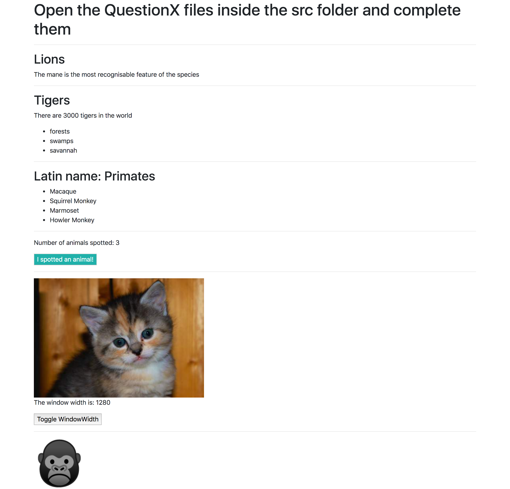

# React quiz

### Set up

1. Fork the CodeYourFuture repo by clicking the button in the top right
2. You will be taken to https://github.com/YOUR_GITHUB_USERNAME/react-quiz
3. Click the "Clone or download" button and copy the URL
4. Run `git clone URL_YOU_COPIED` in the terminal
5. Run `cd react-quiz` to move into the folder you just created
6. Run `npm install` to install dependencies.

### Answering questions

Complete the exercises in the `src` folder. There is a separate file (named
`QuestionX-NAME.js`) for each question.

To see the app in your browser, run `npm start` and it should open it in your
browser once it is running. If you need to stop running, then hit `Ctrl-C`.

There are also some tests provided for you. See the [Using the tests](#using-the-tests)
section below.

You should work on individually on your own computer. Referring to
[course material](https://codeyourfuture.github.io/syllabus-master/react/week-19/lesson.html)
or anything else on the Internet **is ok**. Remember to read the questions and
error messages **carefully**!

The completed app will look something like this in your browser:



### Using the tests

We have provided some unit tests (see `src/__tests__/Quiz.test.js`) to help you
along. To run the tests (after you've `npm install`ed), run `npm test`. This
will put you in "watch mode".

Hit `a` to run all of the tests.

Currently only the test for Question 1 is running - delete the `.skip` before
each other question's tests as you get to it, i.e. change:

```js
  describe.skip("Question 2 - Lions", () => {
```

to:

```js
  describe("Question 2 - Lions", () => {
```

Each question may have multiple tests - try to get them **all** to pass before
moving on.

### When time's up

- `git add` and `git commit` your work (the `master` branch is ok)
- `git push origin master` to push your work to your fork
- Go to https://github.com/YOUR_GITHUB_USERNAME/react-quiz and create a
pull request (there are [instuctions here](https://codeyourfuture.github.io/syllabus-master/others/making-a-pull-request.html#creating-a-pr) if you need help)
- The mentors will provide feedback for you when they have looked at everyone's
work.

